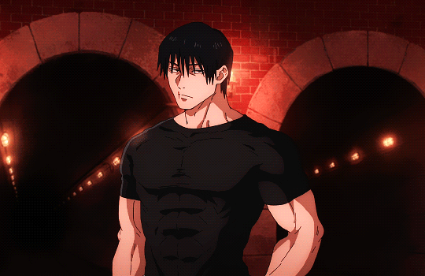
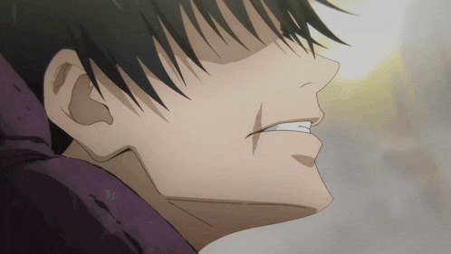
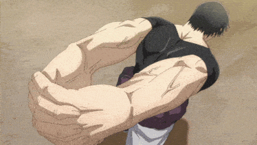

  
  <h2>sup, I’m Yiğit (aka Lilyiit) 👋</h2>

---

### 🌍 About Me
- 👨‍💻 A growth-focused Jr. Developer  
- 🎮 Interested in Game Development (Unity)  
- 📚 Love learning and sharing knowledge  
- 🤝 Value teamwork and collaboration  

---

  

---

### 🚀 Tech & Tools
- 💻 Languages: `C#`, `Python`, `JavaScript`
- 🎮 Game Dev: `Unity`
- 🌐 Web: `React`, `Node.js`, `HTML/CSS`
- ⚙️ Tools: `Git`, `VS Code`, `Windows`

---

  

---

### ⚡ GitHub Stats

  
  

---

### 🖤 Motto
> *“Strength comes from consistency.”*
